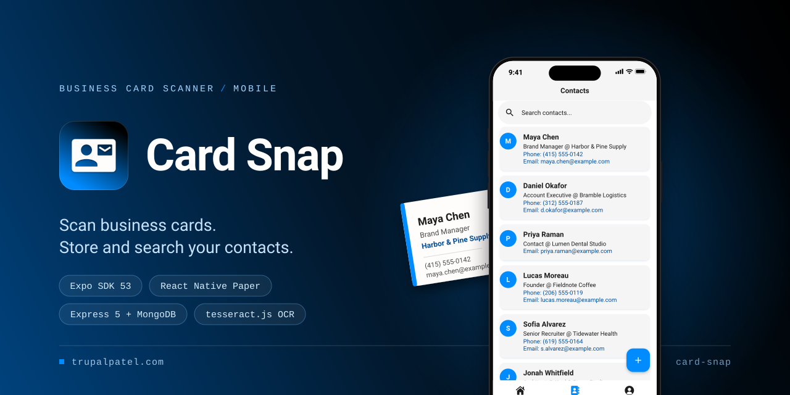
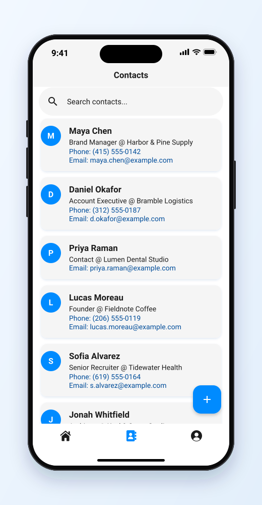
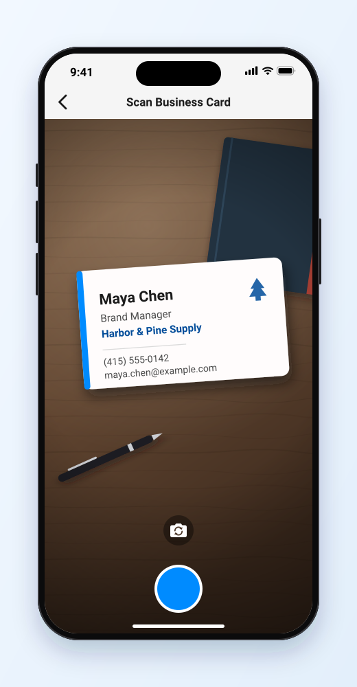
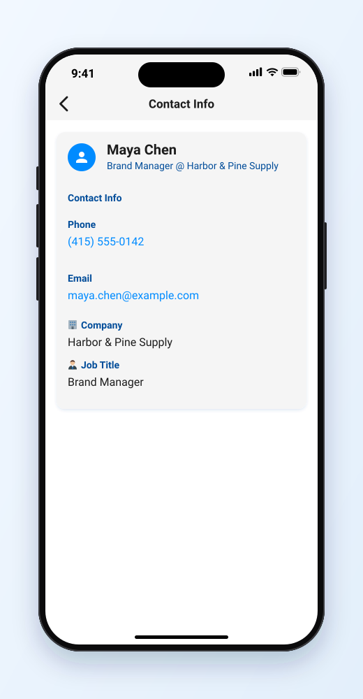
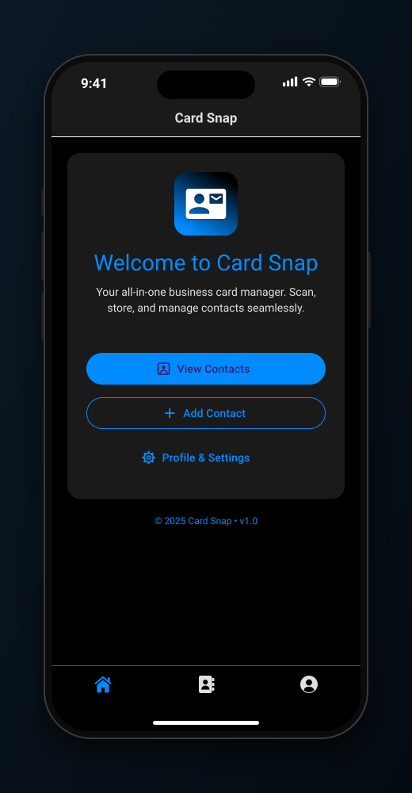
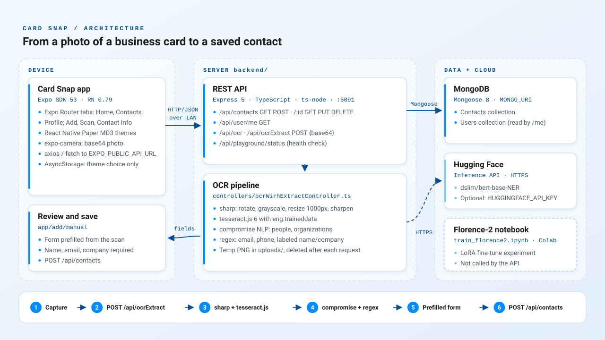

<p align="center">
  
</p>

<p align="center"><strong>A mobile app that turns a photo of a business card into a saved, searchable contact, backed by a Node.js OCR API.</strong></p>

<p align="center">
  <a href="https://trupalpatel.com/projects/card-snap"></a>
  
  
  
  
  
</p>

<p align="center">
  <a href="https://trupalpatel.com/projects/card-snap"><strong>Case study</strong></a> ·
  <a href="https://trupalpatel.com"><strong>Portfolio</strong></a>
</p>

---

## Overview

Business cards pile up and the details rarely make it into a phone. Card Snap (previously called Card Vault) lets you point the camera at a card, reads it on a small Node.js server with Tesseract OCR, and opens a contact form with the name, email, phone and company already filled in, ready to check and save. Saved contacts live in MongoDB and can be searched, called or emailed from the app.

It is a personal project in one repository with two halves: [`frontend/`](frontend/README.md) is the Expo (React Native) app and [`backend/`](backend/README.md) is the Express + TypeScript API. `backend/` also holds an experimental notebook for fine-tuning Florence-2 on card images.

## Features

- **Scan a card**: `expo-camera` takes a photo and posts it to `/api/ocrExtract`; the API cleans it up with `sharp`, reads it with `tesseract.js`, and pulls out name, email, phone and company with `compromise` and regular expressions. The add form opens prefilled for review.
- **Manual entry**: a ten-field form (name, email, company, phone, job title, department, industry, website, address, notes); name, email and company are required.
- **Searchable contact list**: filter by name, email or company, pull to refresh, and a `+` button to add another.
- **Contact details**: tap the phone number to call (with a confirmation dialog) or the email address to open your mail app.
- **Light and dark themes**: React Native Paper MD3 themes in the app's blue, with the choice saved on the device.
- **REST API**: contacts CRUD on MongoDB through Mongoose, a raw-text OCR endpoint, and a status endpoint for health checks.
- **Optional entity recognition**: when a Hugging Face token is set, `/api/ocrExtract` also returns the output of the `dslim/bert-base-NER` model.
- **Florence-2 experiment**: a Colab notebook that LoRA fine-tunes `microsoft/Florence-2-base` on labeled card images. It is not wired into the API.

## Screenshots

<table>
  <tr>
    <td align="center" width="25%">
      
      <br /><sub><b>Contacts</b>: search by name, email or company</sub>
    </td>
    <td align="center" width="25%">
      
      <br /><sub><b>Scan</b>: photograph a card to prefill a contact</sub>
    </td>
    <td align="center" width="25%">
      
      <br /><sub><b>Contact Info</b>: tap to call or email</sub>
    </td>
    <td align="center" width="25%">
      
      <br /><sub><b>Home</b>: dark theme</sub>
    </td>
  </tr>
</table>

<sub>Screens are recreated from the app's real UI in SVG, filled with fictional demo data.</sub>

## Architecture

<p align="center">
  
</p>

The app sends the photo as base64 JSON to the API on your local network. The API preprocesses it with `sharp`, runs `tesseract.js` with the bundled English model, extracts fields with `compromise` and regex (plus the optional Hugging Face call), and returns them; the app uses them to prefill the contact form. Saving posts the contact to `/api/contacts`, which stores it in MongoDB.

## Tech stack

| Layer | Technology |
|---|---|
| App | Expo SDK 53, React Native 0.79, React 19, Expo Router 5 (typed routes), React Native Paper 5 (MD3), `@expo/vector-icons`, `expo-camera`, axios, AsyncStorage |
| API | Node.js, Express 5, TypeScript, ts-node, CORS, dotenv |
| OCR | `sharp`, `tesseract.js` 6 (`eng.traineddata`), `compromise`, Hugging Face Inference API (optional) |
| Data | MongoDB with Mongoose 8 |
| Tooling | EAS Build profiles (`frontend/eas.json`), Google Colab notebook (transformers, peft, datasets) |

## Getting started

### Prerequisites

- Node.js (a current LTS release) and npm; both halves ship a `package-lock.json`
- A MongoDB database (Atlas or local) and its connection string
- The Expo Go app on a phone, or an iOS simulator / Android emulator
- The phone and the computer running the API on the same network

### Install

```bash
git clone https://github.com/TRUPALIX9/card-snap.git
cd card-snap
cd backend && npm install
cd ../frontend && npm install
```

### Environment variables

Copy each `.env.example` to `.env` in the same folder and fill it in.

`backend/.env`

| Variable | Required | Description |
|---|---|---|
| `MONGO_URI` | Yes | MongoDB connection string. The server exits if it can't connect. |
| `PORT` | No | Port for the API. Defaults to `5091`. |
| `LOG_RESPONSE` | No | `true` logs every request and response body (including images and contact data). |
| `HUGGINGFACE_API_KEY` | No | Hugging Face token for the optional NER step. Skipped when empty. |
| `NODE_ENV` | No | `production` turns off the `/api/playground/system` and `/db` diagnostics. |

`frontend/.env`

| Variable | Required | Description |
|---|---|---|
| `EXPO_PUBLIC_API_URL` | Yes | Base URL of the API as seen from the phone: your computer's LAN IP and `PORT`, no trailing slash. |

### Run

```bash
# Terminal 1: the API
cd backend
npm run dev

# Terminal 2: the app
cd frontend
npx expo start
```

The API prints its local and network URLs for `GET /api/playground/status`. Open that network URL from the phone's browser to check that the phone can reach it. In the Expo terminal, scan the QR code with Expo Go, or press `i` / `a` / `w` for iOS, Android or web.

Good to know:

- The Profile tab shows the first document in the MongoDB `users` collection. No API route creates users, so on a new database it shows "Failed to load profile." (the Dark Mode switch still works).
- The API has **no authentication** and allows any origin. Anyone who can reach it can read, change or delete contacts, so run it only on a trusted network for local use.
- There are no automated tests yet. Both halves type-check with `npx tsc --noEmit`.

## Project structure

```text
card-snap/
├── frontend/                  # Expo app (see frontend/README.md)
│   ├── app/                   # Expo Router screens: (tabs), add/, contacts/[id]
│   ├── components/Header.tsx  # Global app bar
│   ├── context/ theme/        # Light/dark theme state and MD3 themes
│   └── eas.json               # EAS Build profiles
├── backend/                   # Express API (see backend/README.md)
│   ├── src/controllers/       # Contacts, OCR and diagnostics handlers
│   ├── src/routes/            # /api routers
│   ├── src/models/            # Mongoose Contact and User schemas
│   ├── eng.traineddata        # Tesseract English language data
│   └── train_florence2.ipynb  # Florence-2 LoRA fine-tuning notebook (experimental)
└── docs/assets/               # README banner, logo, icon, screens, architecture
```

## Roadmap

- [ ] Edit and delete contacts in the app <sub>(the API already has `PUT` and `DELETE /api/contacts/:id`)</sub>
- [ ] Authentication and per-user contacts <sub>(`backend/src/middleware/auth.ts` is a mock and not mounted)</sub>
- [ ] Use the fine-tuned Florence-2 model for extraction <sub>(`backend/train_florence2.ipynb`)</sub>
- [ ] Offline OCR fallback, MMKV storage, NFC/QR contact exchange, tags and filters <sub>(planned features listed in the previous `frontend/README.md`)</sub>

## Author

**Trupal Patel**

<p>
  <a href="https://trupalpatel.com">Portfolio</a> ·
  <a href="mailto:trupal.work@gmail.com">trupal.work@gmail.com</a> ·
  <a href="https://www.linkedin.com/in/trupalix">LinkedIn</a> ·
  <a href="https://github.com/TRUPALIX9">GitHub</a>
</p>
